# TetherHub

## What it is?

Social network app to demonstrate the capabilities of Kotlin Multiplatform.

## Project structure

This is a Kotlin Multiplatform project targeting Android, iOS, Server.

- `/composeApp` is for code that will be shared across the multiplatform applications.
  It contains several subfolders:

  - `commonMain` is for code that’s common for all targets.
  - Other folders are for Kotlin code that will be compiled for only the platform indicated in the
    folder name.

- `/iosApp` is the entry point for the iOS app.

- `/server` is for the Ktor server application.

- `/shared` is for the code that will be shared between all targets in the project.

## Features

|                |                                    |                                           |                                           |                                |
| -------------- | ---------------------------------- | ----------------------------------------- | ----------------------------------------- | ------------------------------ |
| Authentication | 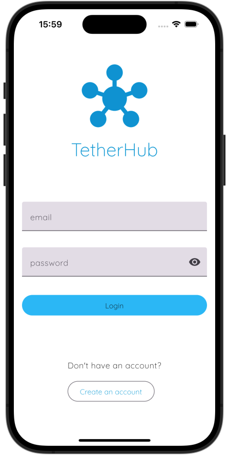    | 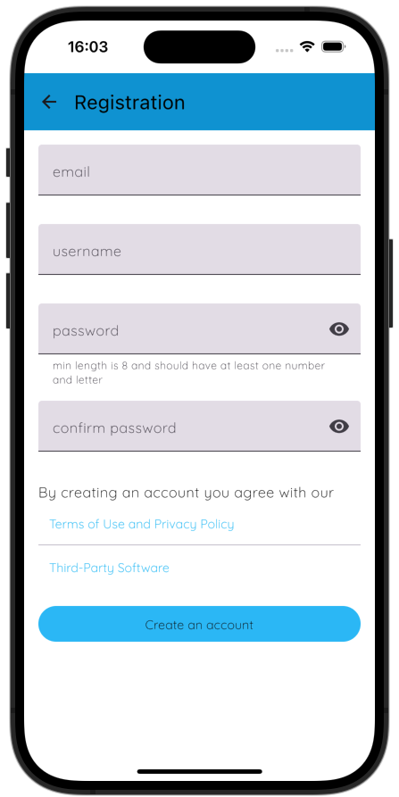    |                                           |                                |
| Posts          | 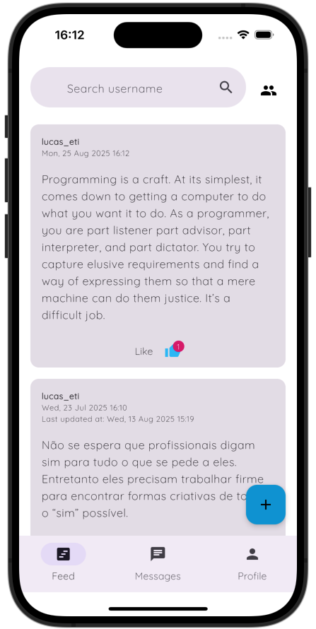     | 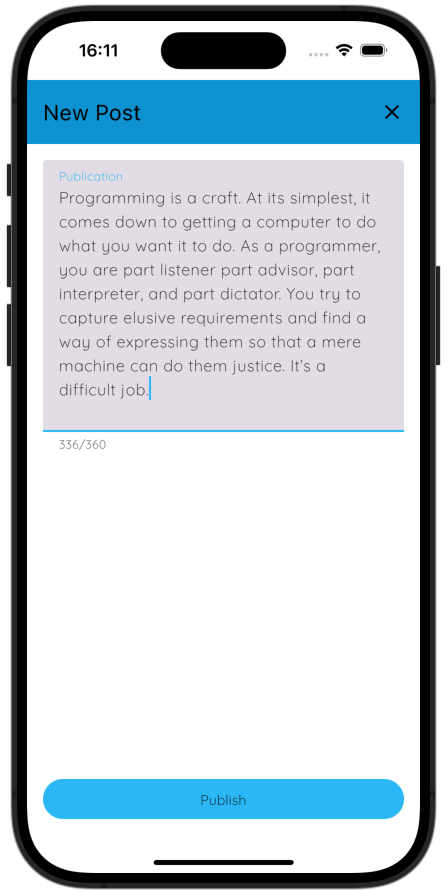        |                                           |                                |
| Chat           | 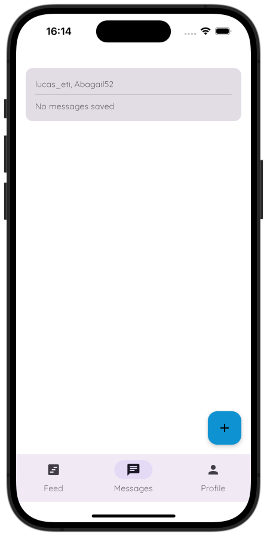 | 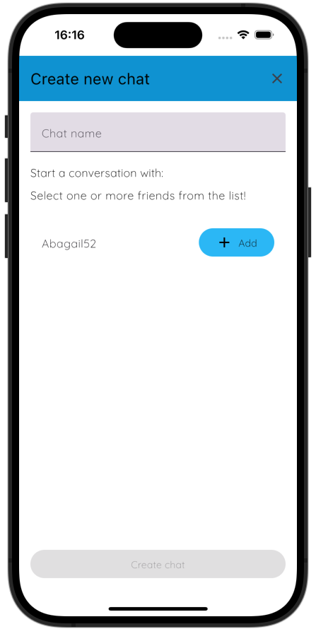        | 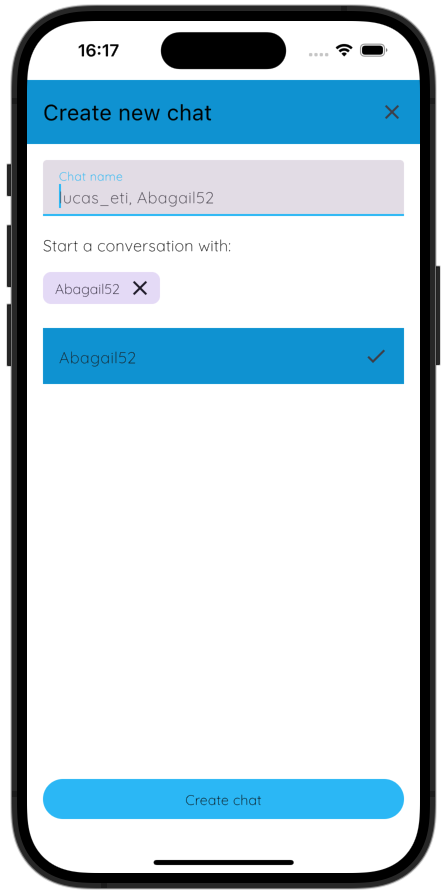 | 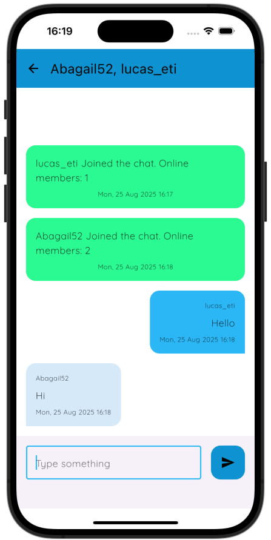 |
| Friends        | 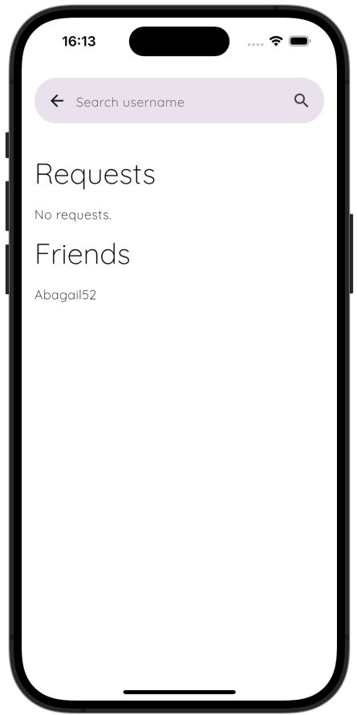  | 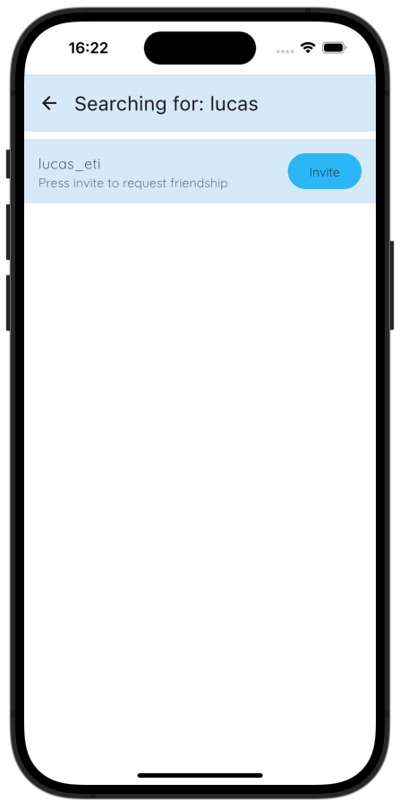  | 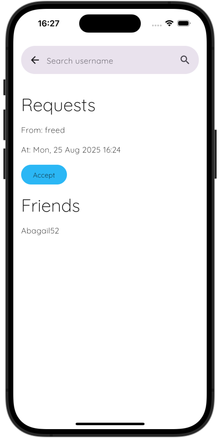  |                                |
| Profile        | 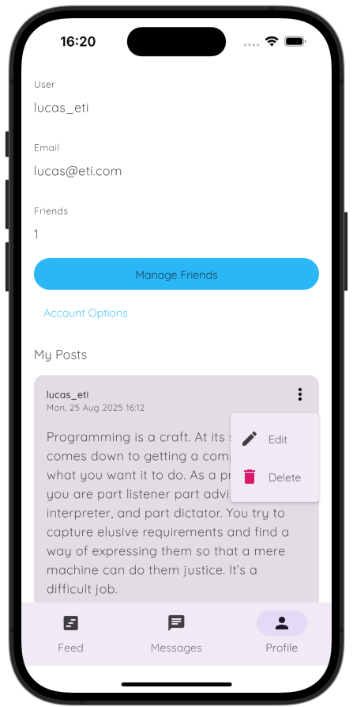  | 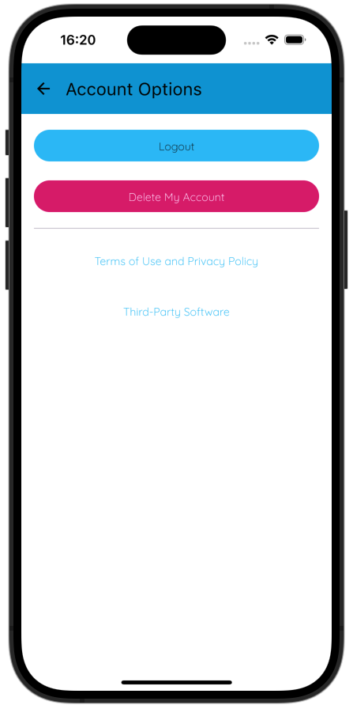 |                                           |                                |

## Tecnologies and core concepts

### Feature based architecture

The project is divided by features and inside each feature package you'll find a MVVM like architecture. Screens are stateless, the state is managed in `ScreenModel` files. Network requests are made in `Client` files. Request and Response models are in the `shared` module, so consistency between server and client is guaranteed.

### Coroutines & Flow

Both the Ktor backend and the multiplaftorm app are using `Flow` and `suspended` functions all over the place.

### Arrow

The `Either` and `Raise` api are used a lot in the server, so errors are returned as values and not thown as exceptions.

### WebSocket and FirebaseMessaging

The chat feature is achieved using WebSockets, every active room is a socket and sockets are created and deleted based on if there's an user connected. If an user from the room is not connected to the socket when a message is sent(very common scenario) the message is sent through FirebaseMessaging and is received as a push notification in the user's device.
